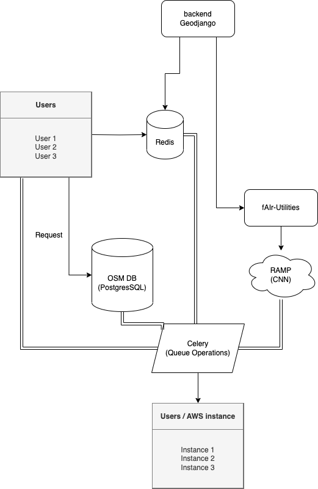

## fAIr Backend

This repository contains the backend sourcecode for the fAIr project. The backend
is composed of several services that are orchestrated using Docker Compose.

The backend of fAIr is powered by
- tensorflow:2.9.2
- django 3.1.2 & geodjango
- celery and flower
- solaris

The pretrained Convolutional Neural Network is base-model is provided by [radiant earth ramp baseline model](https://github.com/radiantearth/model_ramp_baseline)

The CNN is an EfficientNet-UNet encoder-decoder semantic segmentation model. The baseline model have already been pretrained on 1,200,0000 labelled buildings across 22 individuals AOI.
The RAMP model was trained with a particular focus on informal settlements and partially constructed buildings, making it an appropriate base-model for HOT application.

The platform that fAIr provides is a further fine-tuning of the base-line model which enhance the model efficiacy to the desired area.

> The backend codebase and the containersed docker enviornment is currently optimised for deployment on an Debian AWS instance with 4GB. Nvidia GPU and 16 GB. RAM.

> It is recommended to use the provided docker images and cloud instance to deploy the RAMP model. As the Docker images with model, model weights, and peripherial requirements will take up at least 10 Gb. of storage space.

### Structure

The backend codebase is organised into the following main directories and files:

- docker: This directory contains the Docker configurations for the project.
    - ramp: This directory contains the RAMP (Rapid Analytics and Model Prototyping) configurations.
    - solaris: This directory contains the Solaris configurations, a Python library for piping and translation between geospatial and ML formats
    
- requirements.txt: This file lists the Python dependencies required by the project.

### Deploying

The user can pull and deploy fAIr backend by running:

'''bash
docker build .
'''

Before running the docker container, we need to obtain the pre-trained RAMP model.
We will also need to mount it:
'''bash
git clone https://github.com/kshitijrajsharma/ramp-code-fAIr.git ramp-code &&\
cp -r model_ramp_baseline/data/input/checkpoint.tf ramp-code/ramp/checkpoint.tf &&\
wget https://drive.google.com/file/d/1wvJhkiOrSlHmmvJ0avkAdu9sslFf5_I0/view?usp=sharing
unzip checkpoint.tf.zip -d ramp-code/ramp  
'''

Once insider the docker container, the application is boostrapped by calling `manage.py` to bootstrap the geodjango application.

'''bash
docker run .
'''

### Services

The backend is composedof the following services:

- **PostgreSQL Database (with PostGIS)**: This service uses the `postgis/postgis` Docker image
to provide a spatial enabled RDBMS. This is where the geospatial data for this project is stored

- **Redis**: This is an key-value in memory database for the queueing system for User/Instance/Worker celery.
This stores the user list and specifications of task requests for RAMP.

- **App**: This is hte main application service. Built from the Dockerfile, the django and geodjango
bootstraps the various API communication services.

- **Worker**: This is the Celery service that manages the AWS resources. The queueing process can be monitored using **Flower**
nke

#### Flowchart

#### Ports

The services are exposed on the following ports:
- PostgreSQL: 5434
- Redis: 6379
- App: 8000
- Worker Dashboard(Flower): 5500
